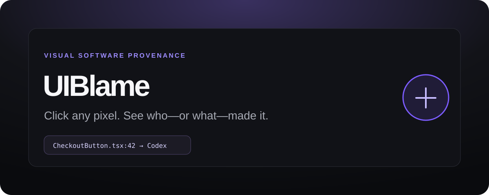

<p align="center">
  
</p>

# UIBlame

**Visual provenance for AI-assisted software.** Click a rendered UI element and trace it back to its source line, local Git history, and explicitly recorded AI provenance.

> **Click any pixel. See who—or what—made it.**

UIBlame is intentionally **not an AI-code classifier**. It never decides that code is AI-generated because it “looks like AI.” A `Verified AI` result requires an explicit provenance record plus matching local evidence. If evidence is missing, the result is `Unknown` — never “human-written.”

## v0.1 scope

The first version is deliberately narrow and local-first:

- Vite dev plugin for JSX/TSX projects.
- Automatic source instrumentation during development only.
- Hover + click inspector in an isolated Shadow DOM.
- `DOM element → source file + line + column`.
- Local `git blame`, commit metadata, working-tree state and diff.
- Evidence states: **Verified AI**, **Recorded AI**, **Unknown**.
- Local JSONL provenance store.
- SHA-256 source-range and prompt hashing.
- CLI for initialization, recording and headless inspection.
- No account, cloud backend, telemetry or source upload.

The repository dogfoods UIBlame: the demo hero has a real provenance record in `.uiblame/provenance.jsonl`, so clicking it can exercise the verified path.

## Run the demo

Requirements: Node.js 20+ and Git.

```bash
npm install
npm run build
npm test
npm run dev
```

Open the Vite URL and click **◎ UIBlame** in the bottom-right, then click an instrumented element. You can also toggle inspection with **Alt+Shift+B**; **Escape** cancels inspection or closes the panel.

## Add it to a Vite project

```bash
npm install -D uiblame
```

```ts
// vite.config.ts
import { defineConfig } from 'vite';
import react from '@vitejs/plugin-react';
import { uiBlame } from 'uiblame';

export default defineConfig({
  plugins: [uiBlame(), react()]
});
```

The plugin uses `apply: "serve"`; production builds are not instrumented.

## Record provenance

Initialize the local store:

```bash
npx uiblame init
```

Record a source range:

```bash
npx uiblame record \
  --file src/CheckoutButton.tsx \
  --lines 42:58 \
  --agent codex \
  --session 0199-demo-session \
  --prompt "Make the checkout CTA easier to notice on mobile"
```

By default, `--prompt` is **not stored as raw text**. UIBlame stores its SHA-256 hash. If the exact text is intentionally safe to keep, add `--store-prompt`.

A record can be verified later by either:

1. the recorded Git commit matching the commit blamed for the selected line; or
2. the current source range matching the SHA-256 content hash captured at record time.

The content-hash path is useful for AI-assisted edits recorded before a later Git commit.

## Inspect without the browser

The CLI can exercise the same Git/provenance path headlessly:

```bash
npx uiblame inspect \
  --file src/CheckoutButton.tsx \
  --line 42
```

It prints JSON containing the source location, Git evidence and provenance result. This is also useful in tests and agent workflows.

## Evidence semantics

| Status | Meaning |
| --- | --- |
| **Verified AI** | A provenance record covers the line and its Git commit or captured source-content hash matches current local evidence. |
| **Recorded AI** | A provenance record covers the line, but the strong evidence no longer matches exactly. This is a recorded claim, not verified current provenance. |
| **Unknown** | No matching provenance record covers the line. This does **not** mean human-written. |

## How it works

```text
Rendered UI
   ↓ click
DOM element
   ↓ dev-only data-uiblame-source marker
file : line : column
   ↓ same-origin local Vite middleware
git blame + git show + working-tree state
   ↓
provenance range + commit/content-hash matching
   ↓
Verified AI / Recorded AI / Unknown
```

The browser runtime never needs to upload the repository. Git and provenance inspection happen on the local development server.

## Why provenance instead of detection?

AI detection asks, “does this code look machine-generated?”

UIBlame asks a different question: **“What evidence exists for where this code came from?”**

That distinction is the product. Heuristics can be wrong in both directions; provenance can be inspected, explained and eventually signed.

## Privacy and security

Prompts and agent sessions can contain secrets. Raw prompt text is therefore opt-in in the CLI. Source paths are constrained to the project root, symbolic source paths are rejected in v0.1, Git commands use argument arrays rather than shell interpolation, and strings rendered in the inspector are HTML-escaped.

The JSONL store is **not yet a cryptographic attestation**. Someone with repository write access can alter it. See [the threat model](docs/threat-model.md) and [provenance format](docs/provenance-spec.md).

## Repository layout

```text
packages/uiblame/   Vite plugin, browser runtime, Git/provenance engine and CLI
apps/demo/          React + Vite dogfooding demo
.uiblame/           local provenance records used by the demo
docs/               architecture, provenance specification and threat model
assets/             README artwork
```

## Project rules

The repository includes [AGENTS.md](AGENTS.md) so coding agents preserve the core invariants, especially:

- no probabilistic “AI percentage” detector;
- `Unknown ≠ Human`;
- local-first core behavior;
- no silent source/prompt/session upload.

See [ROADMAP.md](ROADMAP.md) for work after the v0.1 baseline.

## Non-goals for v0.1

UIBlame does not prove that a local provenance record itself is authentic, automatically ingest Codex/Claude sessions yet, infer human authorship, calculate “AI probability,” or provide visual time travel. Those require later versions and stronger evidence models.

## License

MIT
